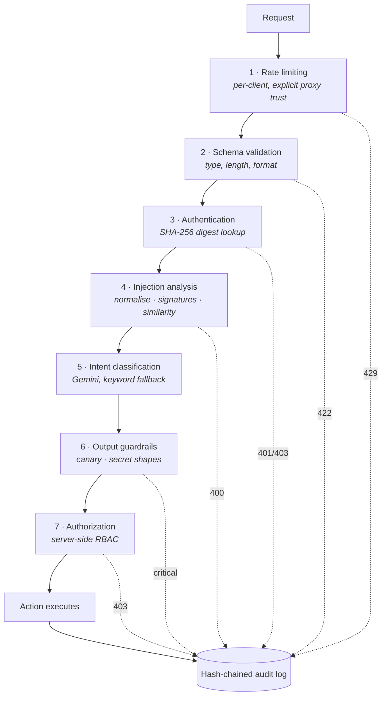
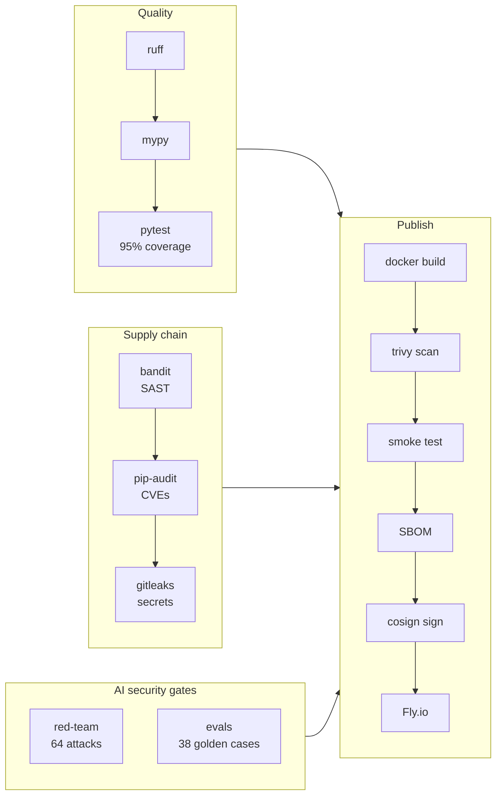

# AI Security API

A secure AI-powered enterprise API that demonstrates production-grade LLM
security patterns — and a CI pipeline that **red-teams its own prompt-injection
defences on every commit**.

[](https://github.com/pushkarchoudhari/ai-security-api/actions/workflows/ci.yml)


---

## The idea

Most "secure API" projects secure the *runtime*. Most "DevOps" projects secure
the *build*. This one does both, and the two pipelines mirror each other:

```
RUNTIME   every request  ->  6 security layers  ->  business logic
BUILD     every commit   ->  8 CI gates         ->  signed container
```

The build pipeline includes two gates a conventional pipeline does not have: an
**adversarial red-team suite** that fails the build if the injection detector
regresses, and an **LLM evaluation harness** that fails the build if intent
classification accuracy drops. Both run offline with no API key, which is what
makes them affordable to run on every push.

---

## Runtime: the request pipeline



### The load-bearing design decision

> **The model proposes. The server disposes.**

The LLM's only output is a *proposed intent*. It never holds credentials, never
executes anything, and cannot widen the caller's permissions. Authorization runs
server-side, immediately before the effect, against the authenticated caller's
role.

This is why prompt injection is survivable here rather than fatal: a fully
jailbroken model returning attacker-chosen JSON can at most *propose* a
different action — which RBAC then refuses. Detection is a filter. The
architecture is the boundary.

Full analysis, including what is **not** defended against: [`docs/THREAT_MODEL.md`](docs/THREAT_MODEL.md).

---

## Build: the CI pipeline



### The AI security gates

**`redteam/`** — 64 adversarial payloads across 13 techniques (instruction
override, prompt extraction, credential exfiltration, persona reassignment,
jailbreak framing, Unicode and zero-width obfuscation, delimiter injection, SQLi,
XSS, path traversal, exfiltration channels, and combinations) plus 30 legitimate
enterprise questions.

The build fails if the **bypass rate exceeds 10%** or the **false positive rate
exceeds 5%**. Both are gated deliberately: a detector optimised only for catch
rate scores 100% by blocking everything, which would make the product useless.

```
attacks blocked      64/64
bypass rate          0.0%   (max 10%)
benign allowed       30/30
false positive rate  0.0%   (max 5%)
```

The corpus is **held out** from the seed attacks the detector is built from —
scoring a detector against its own training examples measures memorisation, not
defence.

**`evals/`** — 38 golden intent-classification cases gated at 90% accuracy.
Catches two distinct regressions: a bad system-prompt edit, and a bad fallback
edit. The fallback matters because it serves *every* request whenever the model
is rate-limited or down.

Both gates found real bugs during development. The red-team suite caught an
initial **28% bypass rate** — five persona attacks and four jailbreak payloads
were scoring 60 against a block threshold of 70, so they never fired. The eval
harness caught a vocabulary gap where "how many deals were closed" fell through
to the generic handler.

---

## Quick start

### In the browser, nothing to install

[](https://codespaces.new/pushkarchoudhari/ai-security-api)

Opens a Linux container with Python 3.12, Docker, and the dev dependencies
already installed. The terminal prints the available commands on first attach.

### Locally

```bash
git clone https://github.com/pushkarchoudhari/ai-security-api.git
cd ai-security-api
pip install -e ".[dev]"
uvicorn app.main:app --reload
```

Open <http://127.0.0.1:8000> for the interactive console. It renders the
request as it moves through the pipeline, marks the layer that stopped it, and
streams the audit hash chain live so you can watch each entry seal the one
before it.

**No API key needed.** The app defaults to `LLM_MODE=mock`, which runs a
deterministic keyword classifier — no network, no cost. To use Gemini:

```bash
cp .env.example .env      # set LLM_MODE=live and GEMINI_API_KEY
```

### Docker

```bash
docker compose up --build
```

### Run the gates yourself

```bash
pytest --cov=app              # 117 tests
python -m redteam.run_redteam # adversarial evaluation
python -m evals.run_evals     # classification accuracy
python -m app.security.audit audit.log   # verify the audit chain
```

---

## Security controls

| Control | Implementation | Bypasses it closes |
|---|---|---|
| **Hashed key store** | SHA-256 digests only; no plaintext key in source (asserted by test) | Source or DB leak yielding usable credentials |
| **Layered injection defence** | Normalise → weighted signatures → trigram similarity | Homoglyphs, zero-width chars, leetspeak, letter-spacing, paraphrase |
| **Prompt canary** | Unique token in system prompt, scanned in output | Silent system-prompt leakage |
| **Output guardrails** | Secret-shape scan; params clamped and stripped | Model output trusted as safe input |
| **Server-side RBAC** | Checked in `execute()` against the authenticated role | Model-proposed privilege escalation |
| **Bulk-export guard** | Empty/vague lookups refused at two independent layers | Directory dump via `"" in anything` |
| **Rate limiting** | Per-client; `X-Forwarded-For` trusted only when configured | Header forgery resetting the bucket |
| **Hash-chained audit** | Each entry seals its predecessor | Silent log rewriting |
| **Opaque errors** | `{"detail": ...}` only; scores stay server-side | Detector tuning feedback, stack traces |

### Why detection details never reach the caller

Blocked requests get a generic message. The risk score, matched signals, and
nearest known attack are written to the audit log. Telling an attacker *which
rule* caught them turns your detector into their test harness.

---

## API

### `POST /ask`

```json
{ "question": "Find employee Priya", "api_key": "sk-viewer-555444" }
```

| Field | Constraints |
|---|---|
| `question` | 3–500 chars, stripped before validation |
| `api_key` | ≥10 chars, must start with `sk-` |

### `POST /admin/audit/verify`

Recomputes the audit hash chain. Admin role required.

```json
{ "valid": true, "entries_checked": 1284, "first_bad_line": null }
```

### `POST /admin/audit/recent`

Tail of the audit chain, newest last. Admin role required.

These entries carry the detection internals — risk score, matched signals,
nearest known attack — that are deliberately withheld from the caller of `/ask`.
That asymmetry is the design: the defender sees why a request was blocked, the
attacker does not.

### `GET /health` · `GET /docs`

Health check and OpenAPI documentation.

### Demo keys

| Key | User | Role | Status |
|---|---|---|---|
| `sk-admin-999888` | Alice | admin | active |
| `sk-analyst-777666` | Bob | analyst | active |
| `sk-viewer-555444` | Charlie | viewer | active |
| `sk-disabled-111000` | Dave | admin | deactivated |

These are demo credentials published on purpose. Only their SHA-256 digests
exist in the source.

---

## Deployment

The public demo runs on Fly.io in **mock mode with no API key deployed**, so it
cannot be turned into free inference or used to drain a quota.

```bash
fly launch --no-deploy --name <your-app-name>
fly volumes create audit_data --size 1 --region <region>
fly deploy
```

CI deploys automatically when the repository variable `FLY_DEPLOY` is `true` and
the `FLY_API_TOKEN` secret is set. Without both, the pipeline stops after
publishing a signed image to GHCR.

---

## Project structure

```
app/
├── main.py              # routes and pipeline orchestration
├── config.py            # env-driven settings
├── actions.py           # business actions + authorization dispatch
├── models.py            # schemas; action allowlist clamping
├── security/
│   ├── audit.py         # hash-chained tamper-evident log
│   ├── auth.py          # authentication
│   ├── injection.py     # 4-layer injection detection
│   ├── guardrails.py    # output scanning, param sanitisation
│   ├── keystore.py      # SHA-256 key store
│   └── rbac.py          # role permissions
└── llm/
    ├── client.py        # Gemini + budget + degradation
    ├── fallback.py      # deterministic keyword classifier
    └── prompts.py       # system prompt + canary injection

tests/      117 tests, 95% coverage
redteam/    64 attacks + 30 benign, bypass-rate gate
evals/      38 golden cases, accuracy gate
docs/       threat model
```

---

## Honest limitations

The point of a security project is knowing where it stops.

- **The red-team corpus is not independent.** It is held out from the detector's
  seed set, but the same person wrote both. 0% bypass is a *regression baseline*,
  not a claim that the detector is unbeatable. A corpus written by someone else
  would score worse, and that would be the more useful number.
- **Detection is lexical, not semantic.** Trigram overlap catches paraphrases
  that share character structure. A genuinely novel phrasing will pass. Embedding
  similarity is the next layer, and it slots in as another signal without
  changing the interface — it is omitted here because it would make the CI gate
  require network access and an API budget.
- **The canary detects verbatim reproduction only.** A model that paraphrases
  its system prompt will not trip it.
- **Everything is in memory.** State is lost on restart. Rate-limit buckets are
  per-process, so multiple instances each enforce their own.
- **Audit tamper-evidence is detective, not preventive.** An attacker with write
  access can still delete the file; they just cannot quietly edit one line.
- **The live Gemini path is the least-tested code.** Its logic is covered by
  tests with a stubbed model, but CI never calls the real API.

---

## Tech stack

FastAPI · Pydantic v2 · Google Gemini (`google-genai`) · SlowAPI · pytest ·
ruff · mypy · bandit · pip-audit · gitleaks · Trivy · Syft · Cosign · Docker ·
GitHub Actions · Fly.io

## License

MIT
